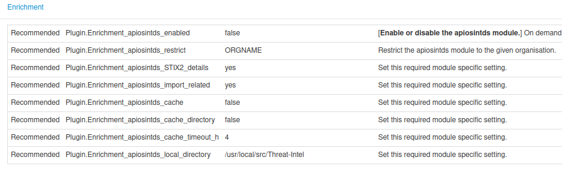
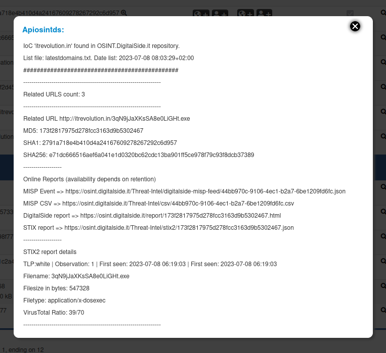
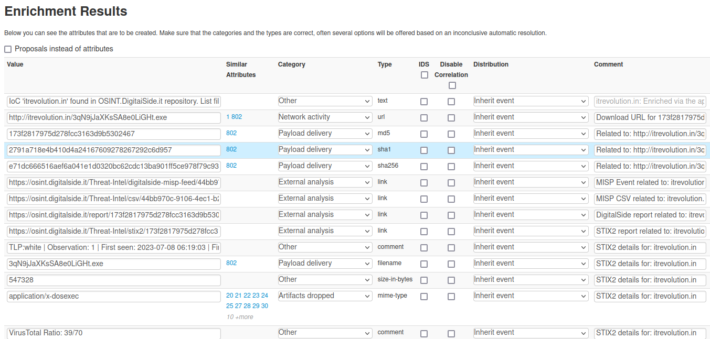

======================
apiosintDS MISP Module
======================

**apiosintDS** is included as enrichment module in the official `MISP-Modules repository <https://github.com/MISP/misp-modules>`_. This guide assume you have your MISP instance up and running with MISP Modules correctly initializated.

The module has been specially designed for people and organizations don't want to subscribe the `DigitalSide Threat-Intel MISP Feed <https://osint.digitalside.it/Threat-Intel/digitalside-misp-feed/>`_ and prefer to query it as an on demand service.

.. warning::
	
	If `DigitalSide Threat-Intel MISP Feed <https://osint.digitalside.it/Threat-Intel/digitalside-misp-feed/>`_ is enabled and regulary fetched by your MISP instance, 
	don't use this plugin. All information retrivable by the plugin are just included in your MISP events dataset.
	The MISP correlation engine should be used instead.

Input / Output
``````````````

.. confval:: Module type

	MISP module type.
	
	:module-type: ``['hover', 'expansion']``

.. confval:: Input

	The module runs against the following MISP attributes type.
	
	:input-attributes: ``["domain", "domain|ip", "hostname", "ip-dst", "ip-src", "ip-dst|port", "ip-src|port"]`` 
	             ``["url", "md5", "sha1", "sha256", "filename|md5", "filename|sha1", "filename|sha256"]``

.. confval:: Output

	The module returns the following MISP attributes type.
	
	:output-attributes: ``["domain", "ip-dst", "url", "comment", "md5", "sha1", "sha256", "link", "text"]``


Configuration
`````````````

Go to your MISP web interface and login with a user account able to edit plugins configuration. Once logged in go to ``Administration >> Server Settings & Maintenance >> Plugin`` and select the ``Enrichment`` tab. Put in the search input filter ``apiosintds`` in order to show only the needed configuration settings.



.. confval:: Plugin.Enrichment_apiosintds_enabled

	Show the help and exit.
 	
	:type: boolean
	:default: ``false``
	
	.. note::
		To enable the plugint configure the valute to ``true``.

.. confval:: Plugin.Enrichment_apiosintds_restrict
	
	Restrict the plugin use to a single organization.
	
	:type: enum
	:default: ``No organization selected``
	:allowed: ``ORG in the given MISP instance``

.. confval:: Plugin.Enrichment_apiosintds_STIX2_details
	
	Dowload and parse additional information from online STIX report.
	
	:type: enum
	:default: ``no``
	:allowed: ``[yes|no]``
	
	.. note::
		STIX2 reports may be not available due to data retention policy.

.. confval:: Plugin.Enrichment_apiosintds_import_related
	
	Parse and include in the results related items.
	
	:type: enum
	:default: ``no``
	:allowed: ``[yes|no]``
	
	.. note::
		Is strongly reccommended to configure it to ``yes`` to obtain best results.		

.. confval:: Plugin.Enrichment_apiosintds_cache
	
	Enable cache mode. Downloaded lists will be stored and won't be downloaded untile the cache timeout is reached.
	
	:type: enum
	:default: ``no``
	:allowed: ``[yes|no]``

.. confval:: Plugin.Enrichment_apiosintds_cache_directory
	
	The cache directory where the script check for cached list files and where them will be stored on cache cache creation or update.
	
	:type: string
	:default: ``None``
	:example: ``/path/to/cachedir``
	
	.. note::
		Read and write permissions are required for the system user running the MISP instance 
		(depends on your installation configuration, should be one between :confval:`www-data`, :confval:`misp`, :confval:`apache`, others...)	

.. confval:: Plugin.Enrichment_apiosintds_cache_timeout_h
	
	Define the cache timeout in hours.
	
	:type: integer
	:default: ``4``
	
	.. note::
		``0`` is allowed but means no timeout. Default value is ``4`` hours. 
		This option needs to be used in combination with :confval:`apiosintds_cache` option configured to True.			

.. confval:: Plugin.Enrichment_apiosintds_local_directory
	
	Absolute path to the 'Threat-Intel' directory related to a local project clone. Searches are performed against local data. 
	
	:type: string
	:default: ``Empty``
	:example: ``/path/to/git/clone/Threat-Intel/``
	
	.. note::
		Before using this option, clone the GitHub project in a file system where 
		the library has read permissions. Don't forget to use `--depth=1` and `--branch=master`
		options if you don't want to download all project commits.
		
		Make sure the system user running the MISP instance has read permissions on the directory.
		
		.. code-block:: bash
			
			$ cd /path/to/git/clone/
			$ git clone --depth=1 --branch=master https://github.com/davidonzo/Threat-Intel.git
			$ chown -R $MISP_SYSTEM_USER`:$MISP_SYSTEM_GROUP Threat-Intel
		
		When this option is in use, all cache related options are ignored. To update data
		in your local repository destroy the existing data and clone it again.
		
		.. code-block:: bash
			
			$ cd /path/to/git/clone/
			$ rm -rf Threat-Intel/
			$ git clone --depth=1 --branch=master https://github.com/davidonzo/Threat-Intel.git
			$ chown -R $MISP_SYSTEM_USER`:$MISP_SYSTEM_GROUP Threat-Intel

Usage: hover
````````````

Using the module as ``hover`` plugin retrived data will be displayed as follow.



Usage: enrichment
`````````````````

Using the module as ``enrichment`` plugin retrived data will be imported as follow.




